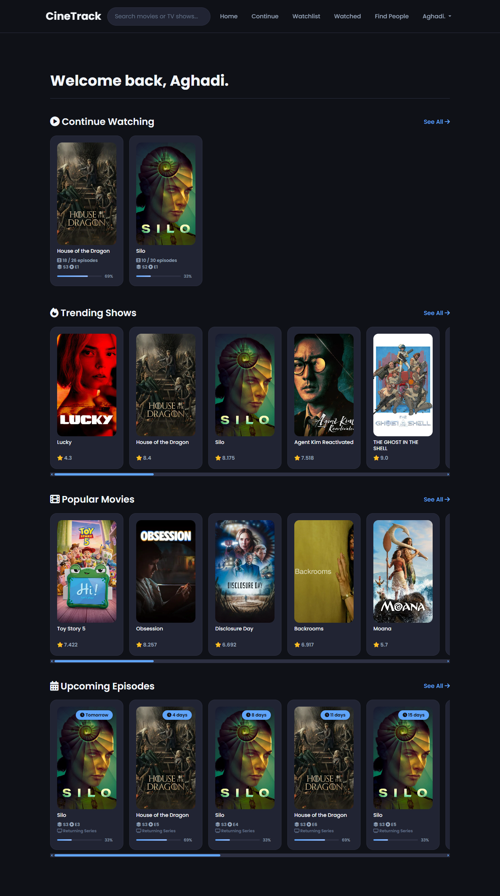
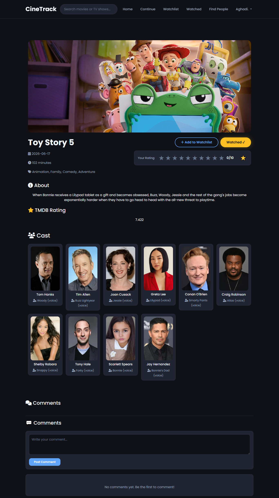
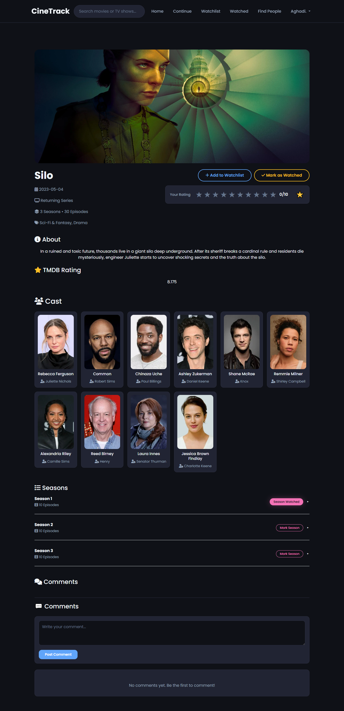
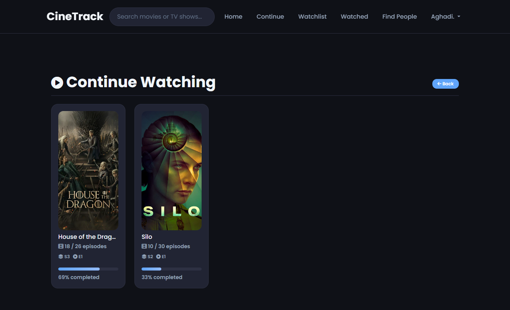
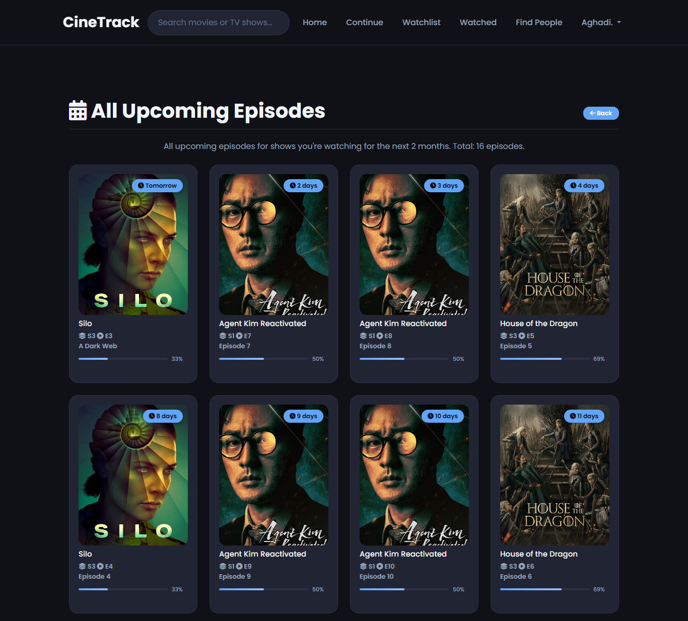
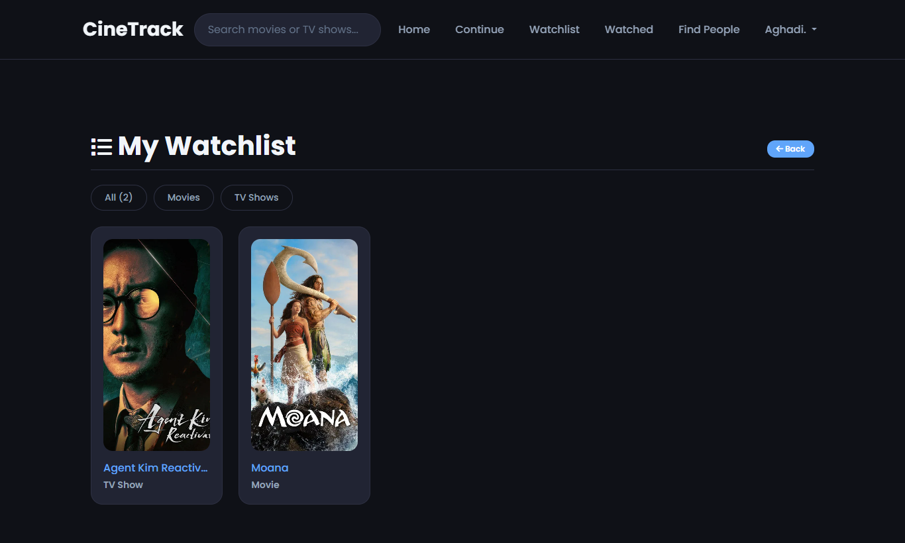
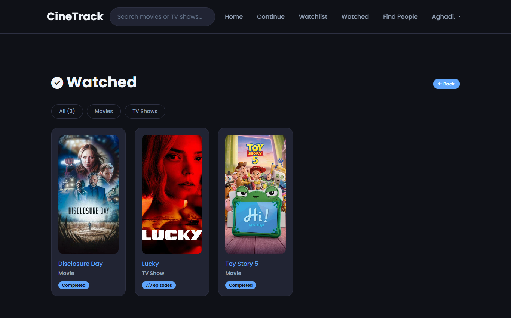
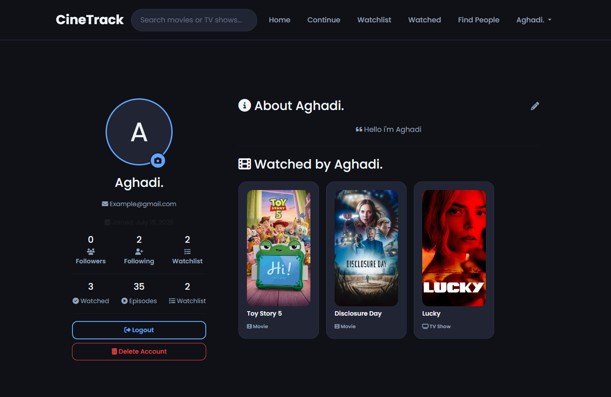
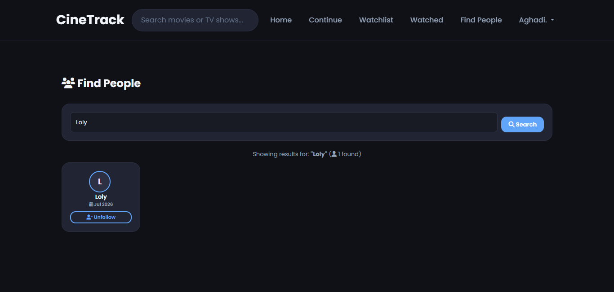
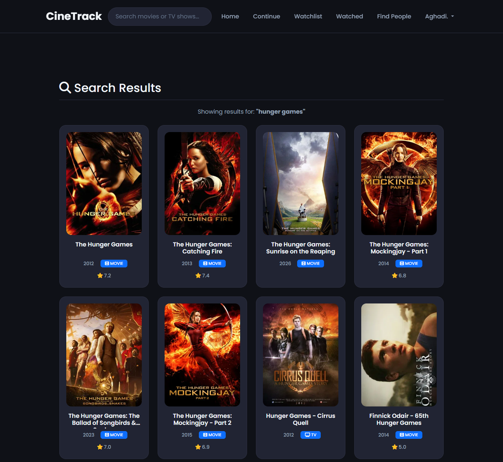

# CineTrack

CineTrack is a Django based movie and TV show tracking platform powered by the TMDB API. It helps users discover movies and TV shows, organize their entertainment experience, track watching progress, manage watchlists, rate content, follow other users, and stay updated with upcoming episodes. Combining content discovery, personalized tracking, and social features, CineTrack provides a modern and responsive interface for managing everything in one place.

---
## Features

### Home Dashboard

- Personalized welcome page
- Continue Watching section with progress tracking
- Popular movies
- Trending TV shows
- Upcoming episodes for currently watched shows

#### Preview



---

### Movie Details

- View complete movie information
- Browse cast members
- Add or remove movies from the watchlist
- Mark movies as watched
- Rate movies from 1 to 10

#### Preview



---

### TV Show Details

- Browse seasons and episodes
- Track watched episodes
- Mark entire seasons as watched
- Continue Watching support
- Rate TV shows
- Add shows to the watchlist

#### Preview



---

### Continue Watching

- Automatically tracks watching progress
- Displays the next episode to watch
- Progress bar for each TV show

#### Preview



---

### Upcoming Episodes

- Displays upcoming episodes for shows currently being watched
- Groups episodes by release date
- Supports expanding the list with "Show More"

#### Preview



---

### Watchlist

- Save movies and TV shows for later
- Manage a personal watchlist

#### Preview



---

### Watched History

- Mark movies as watched
- Track watched TV episodes and seasons
- View watched content from your profile
- Continue Watching updates automatically based on watched episodes

#### Preview



---

### User Profiles

- Profile information
- Favorite genres
- Watching statistics
- Watched history
- Personal watchlist

#### Preview



---

### Social Features

- Follow other users
- Followers and following lists
- Search for other users
- Browse other users' profiles and watched history

#### Preview



---

### Search

- Search for movies and TV shows
- Fast search powered by TMDB
- Direct navigation to content pages

#### Preview



---

## API

This project uses **The Movie Database (TMDB)** API to provide movie and TV show information, including:

- Movie and TV show details
- Cast information
- Seasons and episodes
- Air dates
- Ratings
- Popular movies
- Trending TV shows
- Search functionality

---

## Technologies

- Python
- Django
- SQLite
- HTML5
- CSS3
- JavaScript
- Bootstrap
- TMDB API

---

## Project Structure

```text
CineTrack/
├── accounts/         
├── dashboard/        
├── tracking/          
├── templates/         
│   ├── accounts/     
│   ├── dashboard/     
│   └── includes/      
├── static/            
├── media/             
├── CineTrack/         
├── manage.py          
├── requirements.txt   
├── db.sqlite3         
└── README.md          
```

---

## Acknowledgments

- **The Movie Database (TMDB)** for providing the movie and TV show data.
- **Bootstrap** for the responsive frontend framework.
- **Font Awesome** for the icon library.
